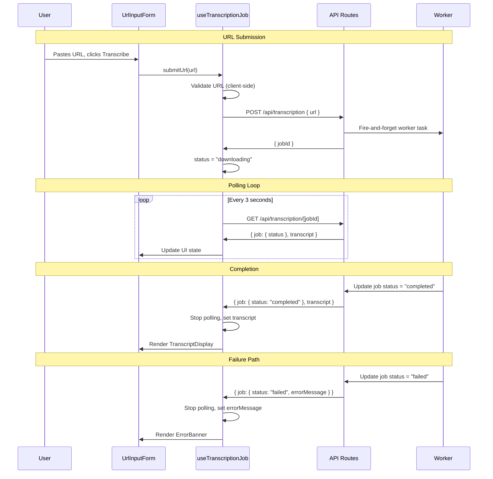

# 01 Ingest YouTube URL for Transcription - Implementation Plan

## User Story

As a content creator, I want to submit a YouTube video URL and have the app automatically extract and transcribe its audio, so that I have a clean text transcript that can be repurposed into other content formats without manual effort.

## Pre-conditions

- Next.js App Router project is initialised with TypeScript and TailwindCSS
- Shadcn UI component library is installed and configured
- PostgreSQL database is provisioned and Prisma is configured
- OpenAI API key is available in environment variables
- `yt-dlp` binary is installed on the server environment (or available via Docker)
- User authentication is in place (Story 07) — transcription jobs must be scoped to a `user_id`
- Environment variables are configured: `OPENAI_API_KEY`, `DATABASE_URL`, `STORAGE_BUCKET` (S3/R2)

## Design

### Visual Layout

The main dashboard is a centred single-column layout. The top section contains the URL submission form. Below it, an active job card appears while transcription is running. Once complete, the transcript panel replaces the job card.

```
┌─────────────────────────────────────────────────────┐
│  [Logo / Nav]                                        │
├─────────────────────────────────────────────────────┤
│                                                      │
│   Ingest a YouTube Video                             │
│   ┌─────────────────────────────────────┐  [Submit] │
│   │ Paste YouTube URL…                  │           │
│   └─────────────────────────────────────┘           │
│   [Validation error message if invalid]              │
│                                                      │
│   ┌─────────────────────────────────────────────┐   │
│   │  ⏳ Extracting audio…  [progress bar]        │   │
│   │  Estimated time: ~2 min for a 30-min video  │   │
│   └─────────────────────────────────────────────┘   │
│                                                      │
│   ┌─────────────────────────────────────────────┐   │
│   │  ✅ Transcript ready                         │   │
│   │  ─────────────────────────────────────────  │   │
│   │  [Full transcript text, scrollable]          │   │
│   └─────────────────────────────────────────────┘   │
│                                                      │
└─────────────────────────────────────────────────────┘
```

### Color and Typography

- **Background Colors**:
  - Page: `bg-gray-50 dark:bg-gray-950`
  - Cards: `bg-white dark:bg-gray-900`
  - Accent / CTA: `bg-indigo-600 hover:bg-indigo-700`

- **Typography**:
  - Page heading: `text-2xl font-semibold text-gray-900 dark:text-white`
  - Body / transcript: `text-sm leading-relaxed text-gray-700 dark:text-gray-300`
  - Helper / sub-labels: `text-xs text-gray-500 dark:text-gray-400`
  - Error text: `text-sm text-red-600 dark:text-red-400`

- **Component-Specific**:
  - Input: `border border-gray-300 focus:ring-2 focus:ring-indigo-500 rounded-md`
  - Submit button: `bg-indigo-600 text-white rounded-md px-4 py-2 hover:bg-indigo-700 disabled:opacity-50`
  - Progress card: `border border-indigo-200 bg-indigo-50 dark:bg-indigo-950/30 rounded-lg p-4`
  - Error banner: `border border-red-200 bg-red-50 dark:bg-red-950/30 rounded-lg p-4`
  - Transcript card: `border border-gray-200 rounded-lg p-4 overflow-y-auto max-h-[60vh]`

### Interaction Patterns

- **URL Input**:
  - On focus: `ring-2 ring-indigo-500` border highlight
  - On blur with invalid value: show inline validation error with fade-in
  - On submit with empty field: prevent request, show required error
  - Paste event: trim whitespace automatically

- **Submit Button**:
  - Default: active, indigo background
  - Loading state: spinner icon replaces label, `disabled` + `opacity-50`
  - After success: re-enabled, form cleared

- **Progress Indicator**:
  - Animated indeterminate progress bar while `DOWNLOADING` or `TRANSCRIBING`
  - Status label updates: "Extracting audio…" → "Transcribing…"
  - Estimated time note for videos over 10 minutes

- **Error State**:
  - Red banner card below the form
  - Icon + message + optional retry action
  - Dismissed automatically when user submits a new URL

### Measurements and Spacing

- **Container**: `max-w-3xl mx-auto px-4 sm:px-6 lg:px-8 py-12`
- **Form row**: `flex gap-3 items-start`
- **Input**: `flex-1 h-10 px-3`
- **Card spacing**: `space-y-4` between form, job card, and transcript card
- **Card padding**: `p-4 md:p-6`

### Responsive Behavior

- **Desktop (lg: 1024px+)**:
  - `max-w-3xl` centred layout
  - URL input and submit button on same row (`flex-row`)
  - Transcript card: `max-h-[60vh]` scrollable

- **Tablet (md: 768px–1023px)**:
  - Same single-column layout, slightly less padding
  - Input row stays horizontal

- **Mobile (sm: < 768px)**:
  - URL input stacks above submit button (`flex-col`)
  - Submit button full-width
  - Transcript card: `max-h-[40vh]`

---

## Technical Requirements

### Component Structure

```
src/app/
├── dashboard/
│   ├── page.tsx                        # Dashboard root page (server component)
│   └── _components/
│       ├── UrlInputForm.tsx            # Controlled form with URL validation
│       ├── TranscriptionJobCard.tsx    # Polling job status + progress display
│       ├── TranscriptDisplay.tsx       # Renders completed transcript text
│       ├── ErrorBanner.tsx             # Reusable error display component
│       └── useTranscriptionJob.ts      # Hook: submit, poll, state machine
├── api/
│   └── transcription/
│       ├── route.ts                    # POST /api/transcription — enqueue job
│       └── [jobId]/
│           └── route.ts               # GET /api/transcription/[jobId] — poll status
└── lib/
    ├── queue/
    │   └── transcription-worker.ts    # Background worker: yt-dlp + Whisper
    ├── ytdlp.ts                       # yt-dlp shell wrapper
    ├── whisper.ts                     # OpenAI Whisper API client
    ├── storage.ts                     # S3/R2 upload/delete helpers
    └── youtube-url.ts                 # YouTube URL validation utility
```

### Required Components

- `UrlInputForm` ⬜
- `TranscriptionJobCard` ⬜
- `TranscriptDisplay` ⬜
- `ErrorBanner` ⬜
- `useTranscriptionJob` (custom hook) ⬜

### State Management Requirements

The `useTranscriptionJob` hook owns all client-side state for this feature. No global store is required for MVP.

```typescript
type JobStatus = 'idle' | 'submitting' | 'downloading' | 'transcribing' | 'completed' | 'failed';

interface TranscriptionJobState {
  // Form
  url: string;
  urlError: string | null;

  // Job lifecycle
  jobId: string | null;
  status: JobStatus;
  errorMessage: string | null;

  // Output
  transcript: string | null;
}

// Actions exposed by the hook
interface TranscriptionJobActions {
  setUrl: (url: string) => void;
  submitUrl: () => Promise<void>;    // validates + POSTs to API
  resetJob: () => void;              // clears job state, re-enables form
}
```

Polling strategy: after `submitUrl` resolves with a `jobId`, the hook starts a `setInterval` (every 3 seconds) calling `GET /api/transcription/[jobId]`. Polling stops when `status` is `completed` or `failed`.

---

## Acceptance Criteria

### Layout & Content

1. URL Input Section
   ```
   - Full-width text input with placeholder "Paste YouTube URL…"
   - Submit button labelled "Transcribe" to the right of the input
   - On mobile: button stacks below input, full-width
   - Inline validation message directly below the input field
   ```

2. Progress Section (visible while job is running)
   ```
   - Indeterminate animated progress bar
   - Status text updates: "Extracting audio…" then "Transcribing…"
   - Estimated time note for videos longer than 10 minutes
   - Form input and button are disabled while job is in progress
   ```

3. Transcript Section (visible when job completes)
   ```
   - Card with header "Transcript Ready"
   - Scrollable text area showing the full transcript
   - Form re-enabled to allow a new submission
   ```

### Functionality

1. URL Validation

   - [ ] Input accepts any string; validation runs on submit (not on keystroke)
   - [ ] Rejects empty input with "Please enter a YouTube URL"
   - [ ] Rejects non-YouTube URLs with "Please enter a valid YouTube URL"
   - [ ] Accepts `youtube.com/watch?v=...`, `youtu.be/...`, and `youtube.com/shorts/...` patterns
   - [ ] Trims leading/trailing whitespace before validation

2. Job Submission & Polling

   - [ ] `POST /api/transcription` returns `{ jobId }` immediately (non-blocking)
   - [ ] Hook begins polling `GET /api/transcription/[jobId]` every 3 seconds
   - [ ] UI transitions through: `submitting` → `downloading` → `transcribing` → `completed`
   - [ ] Polling stops and transcript is displayed on `completed` status
   - [ ] Polling stops and error banner is shown on `failed` status
   - [ ] Polling stops if the component unmounts (cleanup in `useEffect`)

3. Backend Processing

   - [ ] Worker validates URL server-side before invoking `yt-dlp`
   - [ ] `yt-dlp` extracts audio to a temp file in MP3/WAV format
   - [ ] Audio file is sent to `openai.audio.transcriptions.create` (Whisper)
   - [ ] Temp audio file is deleted from disk after Whisper returns a response
   - [ ] Transcript text and job metadata are persisted to PostgreSQL
   - [ ] Job record is linked to the authenticated `user_id`

4. Error Handling

   - [ ] Invalid/private/unavailable video: job status set to `failed` with descriptive message
   - [ ] Whisper API error: job status set to `failed`, error logged server-side
   - [ ] Network timeout on poll: hook retries up to 3 times before showing error
   - [ ] No job record is persisted for a submission that fails before processing begins

### Navigation Rules

- Unauthenticated users are redirected to `/sign-in` before reaching `/dashboard`
- After a successful transcription, the user remains on `/dashboard`; no automatic redirect
- The completed transcript is also accessible later via Story 06 (history)

### Error Handling

- All API routes return structured errors: `{ error: string, code: string }`
- Client error banner displays `error` message from API response
- Server-side errors (yt-dlp failures, Whisper errors) are caught, logged, and translated to user-facing messages — raw stack traces are never surfaced to the client

---

## Modified Files

```
src/app/dashboard/
├── page.tsx ⬜
└── _components/
    ├── UrlInputForm.tsx ⬜
    ├── TranscriptionJobCard.tsx ⬜
    ├── TranscriptDisplay.tsx ⬜
    ├── ErrorBanner.tsx ⬜
    └── useTranscriptionJob.ts ⬜
src/app/api/transcription/
├── route.ts ⬜
└── [jobId]/
    └── route.ts ⬜
src/lib/
├── queue/
│   └── transcription-worker.ts ⬜
├── ytdlp.ts ⬜
├── whisper.ts ⬜
├── storage.ts ⬜
└── youtube-url.ts ⬜
prisma/
└── schema.prisma ⬜  (add TranscriptionJob model)
```

---

## Status

⬜ NOT STARTED

1. Setup & Configuration

   - [ ] Install and configure `yt-dlp` in the server environment
   - [ ] Add `OPENAI_API_KEY`, `STORAGE_BUCKET`, `STORAGE_ENDPOINT` to `.env`
   - [ ] Add `TranscriptionJob` and `Transcript` models to Prisma schema
   - [ ] Run `prisma migrate dev` to apply schema changes
   - [ ] Install `openai` npm package
   - [ ] Install `uuid` or use `crypto.randomUUID` for job ID generation

2. Backend Implementation

   - [ ] Implement `youtube-url.ts` validation utility
   - [ ] Implement `ytdlp.ts` shell wrapper (spawn `yt-dlp`, handle exit codes)
   - [ ] Implement `whisper.ts` OpenAI Whisper client wrapper
   - [ ] Implement `storage.ts` S3/R2 temp-file delete helper
   - [ ] Implement `transcription-worker.ts` end-to-end pipeline
   - [ ] Implement `POST /api/transcription` route (enqueue job, return `jobId`)
   - [ ] Implement `GET /api/transcription/[jobId]` route (return status + transcript)

3. Frontend Implementation

   - [ ] Build `UrlInputForm` component with client-side validation
   - [ ] Build `ErrorBanner` component
   - [ ] Build `TranscriptionJobCard` with animated progress bar
   - [ ] Build `TranscriptDisplay` component
   - [ ] Implement `useTranscriptionJob` hook (submit + polling logic)
   - [ ] Assemble `dashboard/page.tsx` composing all sub-components

4. Testing

   - [ ] Unit tests for `youtube-url.ts` validation (valid and invalid patterns)
   - [ ] Unit tests for `useTranscriptionJob` hook (state transitions, polling cleanup)
   - [ ] Integration test: POST → poll → completed flow with mocked Whisper + yt-dlp
   - [ ] Integration test: POST → poll → failed flow (private video, Whisper error)
   - [ ] Accessibility: input label, button aria-label, error role="alert"
   - [ ] Responsive layout tests at mobile, tablet, and desktop breakpoints

---

## Dependencies

- Story 07 (User Account Authentication) — `user_id` must be available on the session before a job can be persisted
- `yt-dlp` binary available on the server (`PATH` or absolute path in config)
- `openai` npm package (`openai.audio.transcriptions`)
- Prisma + PostgreSQL (`TranscriptionJob` model)
- S3/R2 bucket for temporary audio file handling and transcript storage
- Shadcn `Input`, `Button`, `Card`, `Progress` components

## Related Stories

- 02 (Generate Twitter Thread from Transcript) — consumes the transcript produced here
- 03 (Generate LinkedIn Post from Transcript) — consumes the transcript produced here
- 06 (View Past Repurpose Jobs and Drafts) — reads `TranscriptionJob` records
- 07 (User Account Authentication) — provides `user_id` session context

---

## Notes

### Technical Considerations

1. **Async job queue**: For MVP, the background worker can be implemented as a fire-and-forget `async` function launched from the API route (Next.js edge/node runtime). For production scale, replace with a proper queue (e.g., BullMQ + Redis) to survive server restarts.
2. **yt-dlp execution**: Spawn `yt-dlp` as a child process with `child_process.spawn`. Capture stderr for error detection. Set a timeout to prevent runaway processes on unexpectedly long videos.
3. **Temp file lifecycle**: Write audio to `os.tmpdir()` with a UUID filename. Always delete in a `finally` block regardless of Whisper success or failure to prevent disk exhaustion.
4. **Whisper file size limit**: OpenAI Whisper API accepts files up to 25 MB. For long videos, consider splitting audio using `ffmpeg` before sending, or use the `verbose_json` response format to get word-level timestamps for progress estimation.
5. **Polling vs. WebSockets**: Polling every 3 seconds is sufficient for MVP. Upgrade to Server-Sent Events (SSE) or WebSockets in a later iteration for real-time progress streaming (see Story 04).
6. **Security**: The server-side URL validation must be performed independently of the client-side check — never trust client input. Sanitise the URL before passing it to `yt-dlp` as an argument (use argument array, not shell string interpolation) to prevent command injection.
7. **Rate limiting**: Add rate limiting on `POST /api/transcription` (e.g., 5 submissions per user per hour) to prevent abuse and runaway OpenAI API costs.

### Business Requirements

- Transcription latency for a 30-minute video should be communicated to the user (show estimated wait time in the progress card)
- Raw audio files must be deleted after transcription to control storage costs
- Transcripts must be scoped to the authenticated user — cross-user data access is not permitted
- MVP scope: YouTube URLs only; no podcast/RSS, blog/PDF, or direct upload

### API Integration

#### Type Definitions

```typescript
// src/types/transcription.ts

export type JobStatus =
  | 'pending'
  | 'downloading'
  | 'transcribing'
  | 'completed'
  | 'failed';

export interface TranscriptionJob {
  id: string;
  userId: string;
  youtubeUrl: string;
  status: JobStatus;
  errorMessage: string | null;
  createdAt: string;
  updatedAt: string;
}

export interface Transcript {
  id: string;
  jobId: string;
  text: string;
  createdAt: string;
}

// POST /api/transcription
export interface SubmitUrlRequest {
  url: string;
}

export interface SubmitUrlResponse {
  jobId: string;
}

// GET /api/transcription/[jobId]
export interface JobStatusResponse {
  job: TranscriptionJob;
  transcript: Transcript | null;
}

export interface ApiErrorResponse {
  error: string;
  code: string;
}
```

#### Prisma Schema Addition

```prisma
// prisma/schema.prisma (additions)

model TranscriptionJob {
  id           String    @id @default(cuid())
  userId       String
  youtubeUrl   String
  status       String    @default("pending") // JobStatus enum values
  errorMessage String?
  createdAt    DateTime  @default(now())
  updatedAt    DateTime  @updatedAt
  transcript   Transcript?
  user         User      @relation(fields: [userId], references: [id])
}

model Transcript {
  id        String           @id @default(cuid())
  jobId     String           @unique
  text      String           @db.Text
  createdAt DateTime         @default(now())
  job       TranscriptionJob @relation(fields: [jobId], references: [id])
}
```

### Mock Implementation

#### Mock Server Configuration

```typescript
// mocks/stub.ts
const mocks = [
  {
    endPoint: 'POST /api/transcription',
    json: 'submit-transcription-job.json',
  },
  {
    endPoint: 'GET /api/transcription/:jobId',
    json: 'transcription-job-status.json',
  },
];
```

#### Mock Responses

```json
// mocks/responses/submit-transcription-job.json
{
  "jobId": "clx1234abcdef"
}
```

```json
// mocks/responses/transcription-job-status.json
{
  "job": {
    "id": "clx1234abcdef",
    "userId": "user_abc123",
    "youtubeUrl": "https://www.youtube.com/watch?v=dQw4w9WgXcQ",
    "status": "completed",
    "errorMessage": null,
    "createdAt": "2026-05-27T10:00:00.000Z",
    "updatedAt": "2026-05-27T10:02:30.000Z"
  },
  "transcript": {
    "id": "tr_xyz789",
    "jobId": "clx1234abcdef",
    "text": "Hello and welcome to this video. Today we're going to talk about...",
    "createdAt": "2026-05-27T10:02:30.000Z"
  }
}
```

### State Management Flow



### Custom Hook Implementation

```typescript
// src/app/dashboard/_components/useTranscriptionJob.ts

const POLL_INTERVAL_MS = 3000;
const MAX_POLL_RETRIES = 3;

const useTranscriptionJob = () => {
  const [url, setUrl] = useState('');
  const [urlError, setUrlError] = useState<string | null>(null);
  const [jobId, setJobId] = useState<string | null>(null);
  const [status, setStatus] = useState<JobStatus>('idle');
  const [transcript, setTranscript] = useState<string | null>(null);
  const [errorMessage, setErrorMessage] = useState<string | null>(null);
  const pollRetries = useRef(0);
  const intervalRef = useRef<ReturnType<typeof setInterval> | null>(null);

  const stopPolling = useCallback(() => {
    if (intervalRef.current) {
      clearInterval(intervalRef.current);
      intervalRef.current = null;
    }
  }, []);

  const pollJobStatus = useCallback(async (id: string) => {
    try {
      const res = await fetch(`/api/transcription/${id}`);
      const data: JobStatusResponse | ApiErrorResponse = await res.json();
      if (!res.ok) {
        throw new Error((data as ApiErrorResponse).error);
      }
      const { job, transcript: t } = data as JobStatusResponse;
      setStatus(job.status as JobStatus);
      if (job.status === 'completed' && t) {
        setTranscript(t.text);
        stopPolling();
      } else if (job.status === 'failed') {
        setErrorMessage(job.errorMessage ?? 'Transcription failed. Please try again.');
        stopPolling();
      }
      pollRetries.current = 0;
    } catch {
      pollRetries.current += 1;
      if (pollRetries.current >= MAX_POLL_RETRIES) {
        setErrorMessage('Unable to reach the server. Please refresh and try again.');
        setStatus('failed');
        stopPolling();
      }
    }
  }, [stopPolling]);

  const submitUrl = useCallback(async () => {
    // Client-side validation
    if (!url.trim()) {
      setUrlError('Please enter a YouTube URL');
      return;
    }
    if (!isValidYouTubeUrl(url.trim())) {
      setUrlError('Please enter a valid YouTube URL');
      return;
    }
    setUrlError(null);
    setErrorMessage(null);
    setStatus('submitting');

    try {
      const res = await fetch('/api/transcription', {
        method: 'POST',
        headers: { 'Content-Type': 'application/json' },
        body: JSON.stringify({ url: url.trim() }),
      });
      const data: SubmitUrlResponse | ApiErrorResponse = await res.json();
      if (!res.ok) {
        throw new Error((data as ApiErrorResponse).error);
      }
      const { jobId: id } = data as SubmitUrlResponse;
      setJobId(id);
      setStatus('downloading');
      intervalRef.current = setInterval(() => pollJobStatus(id), POLL_INTERVAL_MS);
    } catch (err) {
      setStatus('failed');
      setErrorMessage(err instanceof Error ? err.message : 'Submission failed. Please try again.');
    }
  }, [url, pollJobStatus]);

  const resetJob = useCallback(() => {
    stopPolling();
    setUrl('');
    setUrlError(null);
    setJobId(null);
    setStatus('idle');
    setTranscript(null);
    setErrorMessage(null);
  }, [stopPolling]);

  // Cleanup on unmount
  useEffect(() => () => stopPolling(), [stopPolling]);

  return { url, setUrl, urlError, jobId, status, transcript, errorMessage, submitUrl, resetJob };
};
```

---

## Testing Requirements

### Integration Tests (Target: 80% Coverage)

1. Core Functionality Tests

```typescript
describe('useTranscriptionJob', () => {
  it('should transition through states: idle → submitting → downloading → completed', async () => {
    // Mock fetch for POST and GET
  });

  it('should display transcript text when job completes', async () => {
    // Assert transcript rendered in TranscriptDisplay
  });

  it('should stop polling after job reaches terminal state', async () => {
    // Assert clearInterval called on completed/failed
  });
});
```

2. Validation Tests

```typescript
describe('YouTube URL Validation', () => {
  it('should accept youtube.com/watch?v= URLs', () => {});
  it('should accept youtu.be/ short URLs', () => {});
  it('should accept youtube.com/shorts/ URLs', () => {});
  it('should reject non-YouTube URLs', () => {});
  it('should reject empty input', () => {});
});
```

3. Edge Cases

```typescript
describe('Edge Cases', () => {
  it('should retry polling up to 3 times on network error', async () => {});
  it('should show error banner when job fails with server message', async () => {});
  it('should cancel polling interval when component unmounts', async () => {});
});
```

### Performance Tests

```typescript
describe('Performance', () => {
  it('should not create multiple polling intervals on re-render', async () => {});
  it('should clean up interval on component unmount', async () => {});
});
```

### Test Environment Setup

```typescript
const mockFetch = (responses: Record<string, unknown>) => {
  global.fetch = jest.fn().mockImplementation((url: string) => {
    const key = Object.keys(responses).find((k) => url.includes(k));
    return Promise.resolve({
      ok: true,
      json: () => Promise.resolve(responses[key ?? '']),
    });
  });
};

beforeEach(() => {
  jest.useFakeTimers();
});

afterEach(() => {
  jest.useRealTimers();
  jest.clearAllMocks();
});
```

### Accessibility Tests

```typescript
describe('Accessibility', () => {
  it('should associate the URL input with a visible label', async () => {});
  it('should render error messages with role="alert"', async () => {});
  it('should disable the submit button with aria-disabled during loading', async () => {});
  it('should announce status updates to screen readers via aria-live', async () => {});
});
```
