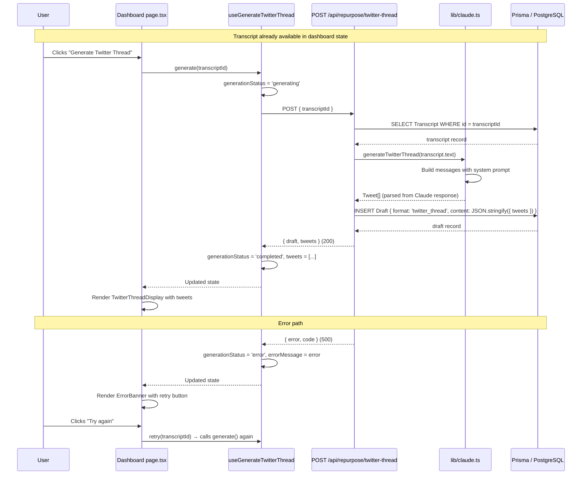

# 02 Generate Twitter Thread from Transcript - Implementation Plan

## User Story

As a content creator, I want to generate a Twitter/X thread from my video transcript with a single click, so that I can publish engaging, shareable thread content on X without spending time manually reformatting my ideas.

## Pre-conditions

- Story 01 (Ingest YouTube URL) is fully implemented — `TranscriptionJob` and `Transcript` models exist in the database
- A completed transcript is available in the UI on the dashboard (`/dashboard`)
- `@anthropic-ai/sdk` is installed (new dependency)
- `ANTHROPIC_API_KEY` environment variable is configured
- Prisma schema has been migrated to include the new `Draft` model
- The dev placeholder user (`DEV_USER_ID`) is in place (Story 07 not yet delivered)

## Design

### Visual Layout

The dashboard extends below the existing `TranscriptDisplay` card. When a transcript is ready, a "Generate Content" action bar appears. Clicking "Generate Twitter Thread" triggers an in-place loading state and then reveals a thread viewer showing individual tweet cards.

```
┌─────────────────────────────────────────────────────┐
│  [Logo / Nav]                                        │
├─────────────────────────────────────────────────────┤
│                                                      │
│   ┌─────────────────────────────────────────────┐   │
│   │  ✅ Transcript ready                         │   │
│   │  [Full transcript text, scrollable]          │   │
│   └─────────────────────────────────────────────┘   │
│                                                      │
│   ┌─────────────────────────────────────────────┐   │
│   │  Generate Content                            │   │
│   │  [🐦 Twitter Thread]  [💼 LinkedIn Post]     │   │
│   └─────────────────────────────────────────────┘   │
│                                                      │
│   ┌─────────────────────────────────────────────┐   │
│   │  🐦 Twitter Thread                           │   │
│   │  ─────────────────────────────────────────  │   │
│   │  ┌─────────────────────────────────────┐    │   │
│   │  │ 1/ [Hook tweet text…]               │    │   │
│   │  └─────────────────────────────────────┘    │   │
│   │  ┌─────────────────────────────────────┐    │   │
│   │  │ 2/ [Second tweet text…]             │    │   │
│   │  └─────────────────────────────────────┘    │   │
│   │  … (more tweet cards)                        │   │
│   └─────────────────────────────────────────────┘   │
│                                                      │
└─────────────────────────────────────────────────────┘
```

**Loading state** (during Claude API call):
```
│   ┌─────────────────────────────────────────────┐   │
│   │  🐦 Generating Twitter Thread…               │   │
│   │  [indeterminate progress bar]                │   │
│   │  Drafting your thread with Claude…           │   │
│   └─────────────────────────────────────────────┘   │
```

**Error state**:
```
│   ┌─────────────────────────────────────────────┐   │
│   │  ⚠️  Failed to generate thread               │   │
│   │  [error message]          [Try again]        │   │
│   └─────────────────────────────────────────────┘   │
```

### Color and Typography

Consistent with the palette established in Story 01:

- **Background Colors**:
  - Page: `bg-gray-50 dark:bg-gray-950`
  - Cards: `bg-white dark:bg-gray-900`
  - Action bar: `bg-white dark:bg-gray-900` with `border border-gray-200 dark:border-gray-700`
  - Generate buttons (idle): `bg-white hover:bg-indigo-50 border border-indigo-200 text-indigo-700`
  - Generate buttons (active/loading): `bg-indigo-600 text-white` (disabled)
  - Tweet cards: `bg-gray-50 dark:bg-gray-800 border border-gray-200 dark:border-gray-700`
  - Error banner: `bg-red-50 dark:bg-red-900/20 border border-red-200 dark:border-red-700`

- **Typography**:
  - Section heading: `text-sm font-semibold text-gray-500 dark:text-gray-400 uppercase tracking-wide`
  - Tweet index label: `text-xs font-mono font-semibold text-indigo-600 dark:text-indigo-400`
  - Tweet body: `text-sm leading-relaxed text-gray-800 dark:text-gray-200`
  - Character count: `text-xs text-gray-400 dark:text-gray-500 text-right`
  - Error text: `text-sm text-red-600 dark:text-red-400`
  - Button label: `text-sm font-medium`

### Interaction Patterns

- **Generate Button**:
  - Idle: white background, indigo border and text
  - Hover: `bg-indigo-50` background transition (150ms ease)
  - Active/Loading: disabled, shows spinner icon inline
  - Already generated: shows "Regenerate" label variant

- **Tweet Card**:
  - Static display only (no editing in Story 02)
  - Subtle hover: `hover:border-gray-300 dark:hover:border-gray-600` (no action yet)
  - Character count displayed in bottom-right corner

- **Error Retry Button**:
  - `bg-red-100 hover:bg-red-200 text-red-700 dark:bg-red-900/40 dark:hover:bg-red-900/60 dark:text-red-300`
  - Clicking resets `generationStatus` to `idle` and re-triggers the API call

### Measurements and Spacing

- **Generate actions bar**:
  ```
  p-4 rounded-xl border bg-white shadow-sm
  flex gap-3 flex-wrap
  ```

- **Twitter thread container**:
  ```
  rounded-xl border bg-white shadow-sm overflow-hidden
  ```

- **Thread header**:
  ```
  px-5 py-4 border-b border-gray-100 dark:border-gray-800
  flex items-center gap-2
  ```

- **Tweet list**:
  ```
  divide-y divide-gray-100 dark:divide-gray-800
  ```

- **Individual tweet card**:
  ```
  px-5 py-4 flex flex-col gap-2
  ```

- **Container (inherited)**:
  ```
  max-w-3xl mx-auto px-4 sm:px-6 lg:px-8 py-12
  ```

### Responsive Behavior

- **Desktop (lg: 1024px+)**:
  - Action buttons inline in a row: `flex-row gap-3`
  - Tweet cards full width within `max-w-3xl` container

- **Tablet (md: 768px - 1023px)**:
  - Same as desktop; container padding adjusts via `sm:px-6`

- **Mobile (sm: < 768px)**:
  - Action buttons wrap: `flex-wrap`
  - Full-width buttons: `w-full sm:w-auto`

## Technical Requirements

### New Dependency

```bash
npm install @anthropic-ai/sdk
```

### New Environment Variable

```
ANTHROPIC_API_KEY=sk-ant-...
```

### Component Structure

```
app/dashboard/
├── page.tsx                              # Modified — passes transcript to new components
└── _components/
    ├── UrlInputForm.tsx                  # Unchanged
    ├── TranscriptionJobCard.tsx          # Unchanged
    ├── TranscriptDisplay.tsx             # Unchanged
    ├── ErrorBanner.tsx                   # Unchanged (reused for generation errors)
    ├── GenerateActionsBar.tsx            # NEW — buttons to trigger generation formats
    ├── TwitterThreadDisplay.tsx          # NEW — container with header + tweet list
    ├── TweetCard.tsx                     # NEW — single tweet with index + char count
    └── useGenerateTwitterThread.ts       # NEW — hook managing generation state + API call

app/api/repurpose/
└── twitter-thread/
    └── route.ts                          # NEW — POST handler

lib/
└── claude.ts                             # NEW — Anthropic client + generateTwitterThread()

prisma/
└── schema.prisma                         # Modified — add Draft model

types/
└── repurpose.ts                          # NEW — Draft, Tweet, GenerationStatus types
```

### Required Components

- `GenerateActionsBar` ⬜
- `TwitterThreadDisplay` ⬜
- `TweetCard` ⬜
- `useGenerateTwitterThread` ⬜

### Prisma Schema Changes

Add the following `Draft` model and update the `Transcript` and `User` models to include the relation:

```prisma
model Draft {
  id           String     @id @default(cuid())
  userId       String
  transcriptId String
  format       String     // "twitter_thread" | "linkedin_post"
  content      String     // JSON string: { "tweets": [{ "index": 1, "text": "..." }] }
  createdAt    DateTime   @default(now())
  updatedAt    DateTime   @updatedAt
  transcript   Transcript @relation(fields: [transcriptId], references: [id])
  user         User       @relation(fields: [userId], references: [id])
}
```

`Transcript` model gains: `drafts Draft[]`
`User` model gains: `drafts Draft[]`

### State Management Requirements

State lives entirely in the `useGenerateTwitterThread` custom hook (no global store), consistent with `useTranscriptionJob`.

```typescript
// types/repurpose.ts

export type GenerationStatus =
  | 'idle'
  | 'generating'
  | 'completed'
  | 'error';

export interface Tweet {
  index: number;
  text: string;
}

export interface TwitterThreadContent {
  tweets: Tweet[];
}

export interface Draft {
  id: string;
  userId: string;
  transcriptId: string;
  format: 'twitter_thread' | 'linkedin_post';
  content: string;         // raw JSON string from DB
  createdAt: string;
  updatedAt: string;
}

// POST /api/repurpose/twitter-thread
export interface GenerateTwitterThreadRequest {
  transcriptId: string;
}

export interface GenerateTwitterThreadResponse {
  draft: Draft;
  tweets: Tweet[];
}

export interface GenerationErrorResponse {
  error: string;
  code: string;
}
```

Hook state shape:

```typescript
interface UseGenerateTwitterThreadState {
  // Status
  generationStatus: GenerationStatus;

  // Data
  tweets: Tweet[];
  draftId: string | null;

  // Error
  errorMessage: string | null;

  // Actions
  generate: (transcriptId: string) => Promise<void>;
  retry: (transcriptId: string) => void;
}
```

## Acceptance Criteria

### Layout & Content

1. Generate Actions Bar
   ```
   - Visible below TranscriptDisplay only when transcript.text is non-empty
   - Contains "Twitter Thread" button (and placeholder for "LinkedIn Post" — Story 03)
   - "Twitter Thread" button shows a spinner and is disabled while generationStatus === 'generating'
   - Once a thread is generated, button label changes to "Regenerate Thread"
   ```

2. Twitter Thread Display
   ```
   - Appears below GenerateActionsBar once generationStatus === 'completed'
   - Header row: bird icon + "Twitter Thread" label + tweet count badge
   - Tweet list rendered as individual TweetCard components in index order
   - Scrollable if many tweets exceed viewport height
   ```

3. Tweet Card
   ```
   - Displays tweet index in "N/" format
   - Displays tweet body text
   - Shows character count in bottom-right (e.g. "142 / 280")
   - Character count turns red if text length > 280
   ```

### Functionality

1. Generation Trigger

   - [ ] "Generate Twitter Thread" button is rendered when `transcript` is non-null in dashboard state
   - [ ] Clicking the button sets `generationStatus` to `'generating'` immediately
   - [ ] The button is disabled and shows a loading spinner during `'generating'` state
   - [ ] No duplicate requests are possible (button disabled while in-flight)

2. API Call & Claude Integration

   - [ ] `POST /api/repurpose/twitter-thread` accepts `{ transcriptId: string }`
   - [ ] The route fetches the `Transcript` record by ID and validates it exists
   - [ ] The route calls `generateTwitterThread(transcriptText)` from `lib/claude.ts`
   - [ ] The Claude call uses the dedicated Twitter thread system prompt
   - [ ] The Claude response is parsed into a `Tweet[]` array
   - [ ] A `Draft` record is saved to the database with `format: 'twitter_thread'` and `content` as serialised JSON
   - [ ] The route returns `{ draft, tweets }` (200)

3. Thread Display

   - [ ] Each tweet in the response is rendered as a `TweetCard` in index order
   - [ ] Character count is displayed per tweet
   - [ ] Total tweet count is displayed in the section header
   - [ ] Thread persists in UI across minor interactions (no re-fetches needed within a session)

4. Error Handling

   - [ ] If the API returns a non-2xx response, `generationStatus` is set to `'error'` and `errorMessage` is populated
   - [ ] An error banner is shown with the error message and a "Try again" button
   - [ ] Clicking "Try again" re-invokes `generate(transcriptId)` without any page reload
   - [ ] The existing transcript and URL form are unaffected by a generation error

### Navigation Rules

- The generation section appears on the same `/dashboard` page — no navigation required
- No routing change is needed for Story 02; draft detail pages are out of scope

### Error Handling

- Network/timeout errors from the Claude API are caught in the API route and returned as `{ error: string, code: 'CLAUDE_API_ERROR' }` (500)
- Missing transcript returns `{ error: 'Transcript not found', code: 'TRANSCRIPT_NOT_FOUND' }` (404)
- Invalid request body (missing `transcriptId`) returns `{ error: 'transcriptId is required', code: 'INVALID_REQUEST' }` (400)
- JSON parse failures on Claude's response are caught and returned as `{ error: 'Failed to parse thread output', code: 'PARSE_ERROR' }` (500)

## Modified Files

```
prisma/
└── schema.prisma ⬜                    # Add Draft model + relations

types/
└── repurpose.ts ⬜                      # New — generation types

lib/
└── claude.ts ⬜                         # New — Anthropic client + generateTwitterThread()

app/api/repurpose/twitter-thread/
└── route.ts ⬜                          # New — POST handler

app/dashboard/
├── page.tsx ⬜                          # Modified — wire up generation section
└── _components/
    ├── GenerateActionsBar.tsx ⬜        # New
    ├── TwitterThreadDisplay.tsx ⬜      # New
    ├── TweetCard.tsx ⬜                 # New
    └── useGenerateTwitterThread.ts ⬜   # New
```

## Status

⬜ NOT STARTED

1. Setup & Configuration

   - [ ] Install `@anthropic-ai/sdk` dependency
   - [ ] Add `ANTHROPIC_API_KEY` to `.env` and document in README
   - [ ] Add `Draft` model to `prisma/schema.prisma` with `Transcript` and `User` relations
   - [ ] Run `prisma migrate dev --name add-draft-model` to apply schema changes
   - [ ] Create `types/repurpose.ts` with all generation-related type definitions

2. Backend Implementation

   - [ ] Create `lib/claude.ts` — instantiate `Anthropic` client, implement `generateTwitterThread(transcriptText: string): Promise<Tweet[]>`
   - [ ] Define Twitter thread system prompt constant in `lib/claude.ts`
   - [ ] Create `app/api/repurpose/twitter-thread/route.ts` — validate request, fetch transcript, call Claude, save Draft, return response
   - [ ] Validate that all error paths return `{ error, code }` shape consistent with existing routes

3. Frontend Implementation

   - [ ] Create `useGenerateTwitterThread.ts` hook with `generationStatus`, `tweets`, `draftId`, `errorMessage`, `generate`, and `retry`
   - [ ] Create `GenerateActionsBar.tsx` — renders action buttons, conditionally visible when transcript is present
   - [ ] Create `TweetCard.tsx` — tweet index, body text, character count with overflow indicator
   - [ ] Create `TwitterThreadDisplay.tsx` — section header, tweet count badge, scrollable list of `TweetCard`s, loading skeleton, and error state
   - [ ] Modify `app/dashboard/page.tsx` to pass `transcript` to `GenerateActionsBar` and render `TwitterThreadDisplay`

4. Testing

   - [ ] Verify happy path: transcript → click generate → loading state → tweet cards rendered
   - [ ] Verify all tweets are ≤ 280 characters (inspect Claude output)
   - [ ] Verify error state: mock API failure → error banner shown → retry succeeds
   - [ ] Verify button is disabled during in-flight request (no duplicate submissions)
   - [ ] Verify `Draft` record is persisted in DB with correct `format` and `content`
   - [ ] Verify character count turns red when a tweet exceeds 280 characters

## Dependencies

- Story 01 (Ingest YouTube URL for Transcription) — `Transcript` model and dashboard must exist
- `@anthropic-ai/sdk` npm package
- `ANTHROPIC_API_KEY` environment variable
- Story 07 (User Account Authentication) — `userId` is currently a placeholder; generation routes must be updated when auth lands

## Related Stories

- 01 (Ingest YouTube URL for Transcription — provides the `Transcript` source)
- 03 (Generate LinkedIn Post — parallel output format; `GenerateActionsBar` accommodates both)
- 05 (Edit and Copy Draft — builds on the `Draft` model introduced here)
- 06 (View Repurpose History — lists all `Draft` records including Twitter threads)

## Notes

### Technical Considerations

1. **Anthropic SDK vs OpenAI SDK**: The project currently uses the `openai` package for Groq. Claude requires the `@anthropic-ai/sdk` package — these are separate clients. Do not attempt to reuse the Groq client for Claude.
2. **System prompt design**: The prompt must instruct Claude to return a strictly parseable JSON object (`{ "tweets": [{ "index": number, "text": string }] }`). Freeform text responses will cause `PARSE_ERROR`. Use `response_format`-style instructions in the prompt body.
3. **Claude model**: Use `claude-sonnet-4-5` (or the latest Claude Sonnet model specified in the Anthropic SDK). Verify the exact model name string from the Anthropic docs at implementation time.
4. **Token cost**: At typical transcript lengths (5,000–15,000 tokens input), a Claude Sonnet call for a Twitter thread should cost ~$0.15–$0.40 as noted in the story.
5. **Draft content storage**: `content` is stored as a serialised JSON string in a plain `String` column (not a Postgres `jsonb` column). This avoids Prisma typing complexity for MVP; can be migrated to `Json` type in a later story.
6. **Character count enforcement**: The system prompt instructs Claude to stay within 280 characters per tweet. The UI adds a visual indicator but the API does **not** reject tweets that exceed the limit — enforcing exact character counts in LLM output is unreliable.
7. **No streaming for MVP**: The API route returns the full thread synchronously (non-streaming). Story 04 (Stream Repurposed Drafts) can retrofit streaming if desired.

### Business Requirements

- First tweet must act as a hook designed to drive engagement (enforced via system prompt)
- Output must be structured as a numbered sequence (1/, 2/, 3/…)
- Draft must be associated with the source transcript and the user's account in the database
- Error recovery must not require re-submitting the transcript (retry reuses the existing `transcriptId`)

### API Integration

#### System Prompt

```
You are an expert social media strategist specialising in Twitter/X threads.

Transform the provided transcript into a high-engagement Twitter thread.

Rules:
- Return ONLY a valid JSON object. Do not include any explanation, markdown, or prose outside the JSON.
- The JSON must have this exact shape: { "tweets": [ { "index": 1, "text": "..." }, ... ] }
- The thread must have between 5 and 15 tweets.
- Tweet 1 MUST be a compelling hook that makes the reader want to read the rest of the thread.
- Every tweet's "text" field must be 280 characters or fewer (including the "N/" prefix if you use one).
- Use line breaks within tweet text for readability.
- End the thread with a summary or call-to-action tweet.
- Focus on the most valuable, shareable insights from the transcript.
- Write in a conversational, first-person style.
```

#### Type Definitions

```typescript
// types/repurpose.ts

export type GenerationStatus = 'idle' | 'generating' | 'completed' | 'error';
export type DraftFormat = 'twitter_thread' | 'linkedin_post';

export interface Tweet {
  index: number;
  text: string;
}

export interface TwitterThreadContent {
  tweets: Tweet[];
}

export interface Draft {
  id: string;
  userId: string;
  transcriptId: string;
  format: DraftFormat;
  content: string;
  createdAt: string;
  updatedAt: string;
}

export interface GenerateTwitterThreadRequest {
  transcriptId: string;
}

export interface GenerateTwitterThreadResponse {
  draft: Draft;
  tweets: Tweet[];
}

export interface GenerationErrorResponse {
  error: string;
  code: string;
}
```

### State Management Flow



### Mock Implementation

#### Mock Server Configuration

```typescript
// mocks/stub.ts (if a mock layer is added)
const mocks = [
  {
    endPoint: '/api/repurpose/twitter-thread',
    method: 'POST',
    json: 'twitter-thread.json',
  },
];
```

#### Mock Response

```json
// mocks/responses/twitter-thread.json
{
  "draft": {
    "id": "cma0000000000001",
    "userId": "dev-user-placeholder",
    "transcriptId": "cma0000000000000",
    "format": "twitter_thread",
    "content": "{\"tweets\":[{\"index\":1,\"text\":\"Most people waste hours turning video content into tweets.\\n\\nHere's how AI can do it in seconds 🧵\"},{\"index\":2,\"text\":\"2/ The transcript is the source of truth. Once you have text, every other format is just a transformation away.\"},{\"index\":3,\"text\":\"3/ Short-form content doesn't mean less value. It means distilled value.\"}]}",
    "createdAt": "2026-05-27T10:00:00.000Z",
    "updatedAt": "2026-05-27T10:00:00.000Z"
  },
  "tweets": [
    { "index": 1, "text": "Most people waste hours turning video content into tweets.\n\nHere's how AI can do it in seconds 🧵" },
    { "index": 2, "text": "2/ The transcript is the source of truth. Once you have text, every other format is just a transformation away." },
    { "index": 3, "text": "3/ Short-form content doesn't mean less value. It means distilled value." }
  ]
}
```

## Testing Requirements

### Integration Tests (Target: 80% Coverage)

1. Core Functionality Tests

```typescript
describe('POST /api/repurpose/twitter-thread', () => {
  it('should return 201 with draft and tweets on success', async () => {
    // Mock Claude response, assert Draft saved and tweets returned
  });

  it('should return 404 when transcriptId does not exist', async () => {
    // Assert { error, code: 'TRANSCRIPT_NOT_FOUND' }
  });

  it('should return 400 when transcriptId is missing from request body', async () => {
    // Assert { error, code: 'INVALID_REQUEST' }
  });

  it('should return 500 and CLAUDE_API_ERROR when Anthropic API throws', async () => {
    // Mock Anthropic SDK to throw, assert error response
  });

  it('should return 500 and PARSE_ERROR when Claude response is not valid JSON', async () => {
    // Mock Anthropic to return malformed text, assert error response
  });
});
```

2. Component Tests

```typescript
describe('TweetCard', () => {
  it('should display tweet index and body text', () => {
    // Render TweetCard, assert index label and text content visible
  });

  it('should show character count in "N / 280" format', () => {
    // Assert character count renders correctly
  });

  it('should display character count in red when text exceeds 280 chars', () => {
    // Render with oversized text, assert red styling applied
  });
});

describe('TwitterThreadDisplay', () => {
  it('should render a TweetCard for each tweet in the array', () => {
    // Provide 7 tweets, assert 7 cards rendered
  });

  it('should display tweet count in the header', () => {
    // Assert "7 tweets" label is visible
  });
});

describe('useGenerateTwitterThread', () => {
  it('should set generationStatus to generating immediately on generate()', async () => {
    // Intercept mid-flight, assert status
  });

  it('should populate tweets and set status to completed on success', async () => {
    // Mock fetch success, assert hook state
  });

  it('should set status to error and populate errorMessage on API failure', async () => {
    // Mock fetch failure, assert error state
  });

  it('should allow retry after an error without page reload', async () => {
    // Call generate(), fail, call retry(), succeed — assert completed state
  });
});
```

3. Edge Cases

```typescript
describe('Edge Cases', () => {
  it('should handle a single-tweet response gracefully', async () => {
    // Assert UI renders without crashing for tweets.length === 1
  });

  it('should handle a transcript that produces 15 tweets (maximum)', async () => {
    // Assert all 15 TweetCards render correctly
  });

  it('should not allow a second generate() call while one is in-flight', async () => {
    // Button disabled state prevents concurrent calls
  });
});
```

### Accessibility Tests

```typescript
describe('Accessibility', () => {
  it('should announce generation completion to screen readers', async () => {
    // Assert aria-live region updates when generationStatus changes to completed
  });

  it('should provide an accessible label for the generate button spinner', async () => {
    // Assert aria-label="Generating Twitter thread, please wait" while loading
  });
});
```
