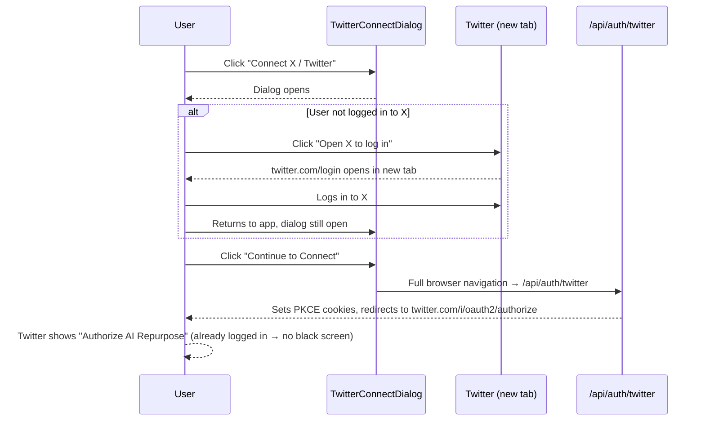

# FEAT-001 Twitter OAuth Pre-login Dialog - Implementation Plan

## User Story

As a user connecting my X/Twitter account, I want to be warned to log in to X first before being redirected, so that I avoid the black/blank authorization screen caused by Twitter's SSO rendering bug when I am not already authenticated on X.

## Pre-conditions

- User is authenticated in the app (logged in to their AI Repurpose account)
- User is on the `/settings` page
- User has NOT yet connected a Twitter/X account (or has an expired token)
- The `Dialog` component from `components/ui/dialog.tsx` is available (Base UI)
- The `Button` component from `components/ui/button.tsx` is available
- `TWITTER_CLIENT_ID` and `NEXT_PUBLIC_APP_URL` env vars are set

## Design

### Visual Layout

A modal dialog centered on screen with three sections:

```
┌────────────────────────────────────────┐
│  [X logo icon]                         │
│  Connect X / Twitter                   │
│                                        │
│  ⚠ Before you continue                 │
│  You must already be logged in to X   │
│  in this browser. If you're not, the  │
│  authorization screen may appear       │
│  blank.                                │
│                                        │
│  [Open X to log in ↗]                 │
│  (opens twitter.com in a new tab)      │
│                                        │
│  Once you're logged in to X, click:   │
│  [ Cancel ]  [ Continue to Connect → ]│
└────────────────────────────────────────┘
```

### Color and Typography

- **Dialog background**: `bg-white dark:bg-gray-900`
- **Warning block**: `bg-amber-50 dark:bg-amber-950 border border-amber-200 dark:border-amber-800 rounded-lg`
- **Warning text**: `text-amber-800 dark:text-amber-200 text-sm`
- **Warning icon**: `text-amber-500` (TriangleAlert from lucide-react)
- **Heading**: `font-semibold text-gray-900 dark:text-white text-lg`
- **Body text**: `text-sm text-gray-600 dark:text-gray-400`
- **"Open X to log in" button**: `variant="outline"` with external link icon
- **"Continue to Connect" button**: `bg-black hover:bg-gray-900 dark:bg-white dark:text-black` (matches existing Connect button style)
- **"Cancel" button**: `variant="ghost"`

### Interaction Patterns

- **Trigger**: Clicking "Connect X / Twitter" opens the dialog (replaces the direct `<a>` navigation)
- **"Open X to log in"**: Opens `https://twitter.com/login` in a new tab (`target="_blank" rel="noopener noreferrer"`); dialog stays open
- **"Continue to Connect"**: Navigates to `/api/auth/twitter` (same as current `<a href` behaviour); dialog closes
- **"Cancel"**: Closes dialog, no action taken
- **Dismiss**: Clicking the backdrop or pressing Escape closes the dialog
- **Reconnect path**: The "Reconnect" button in `ConnectedAccountCard` uses the same dialog

### Measurements and Spacing

```
Dialog content:   max-w-md w-full p-6
Warning block:    p-4 rounded-lg
Button row:       flex justify-end gap-3 mt-6
Icon + heading:   flex items-center gap-2 mb-4
Warning body:     space-y-2
```

### Responsive Behavior

- **Desktop (lg: 1024px+)**: Centered modal, `max-w-md`
- **Tablet (md: 768px–1023px)**: Same centered modal, full padding
- **Mobile (< 768px)**: Full-width with `mx-4` side margins, stacked buttons (`flex-col-reverse`)

## Technical Requirements

### Component Structure

```
app/settings/
├── page.tsx                          (no change)
└── _components/
    ├── ConnectedAccountsSection.tsx  (modified — swap <a> for dialog trigger)
    ├── ConnectedAccountCard.tsx      (modified — swap Reconnect <a> for dialog trigger)
    ├── TwitterConnectDialog.tsx      (NEW — the dialog component)
    ├── SettingsToastHandler.tsx      (no change)
    └── useConnectedAccounts.ts       (no change)
```

### Required Components

- [x] `Dialog`, `DialogTrigger`, `DialogPortal`, `DialogOverlay`, `DialogClose` — already in `components/ui/dialog.tsx`
- [x] `Button` — already in `components/ui/button.tsx`
- [ ] `TwitterConnectDialog` — new component to create
- [x] `TriangleAlert` icon — from `lucide-react` (already a dependency)
- [x] `ExternalLink` icon — from `lucide-react`

### State Management Requirements

```typescript
// TwitterConnectDialog is self-contained; no external state needed.
// Internal state managed by Base UI's Dialog primitive (controlled via open/onOpenChange).

interface TwitterConnectDialogProps {
  // No props needed — the trigger and redirect URL are fixed.
  // Optionally accept a `redirectTo` prop if this pattern is reused for LinkedIn.
}
```

The dialog is **uncontrolled** — Base UI's `Dialog.Root` manages open/close state internally via the `Trigger` subcomponent. No `useState` required in the parent.

## Acceptance Criteria

### Layout & Content

1. Dialog appearance
   - Dialog has the X logo or a recognisable X/Twitter heading
   - Warning block is visually distinct (amber/yellow tone)
   - Warning text clearly states the user must be logged in to X before continuing
   - "Open X to log in" button is present and visually secondary
   - "Continue to Connect" button is present and visually primary (dark/black)
   - "Cancel" button is present as a ghost/tertiary action

2. Trigger placement
   - "Connect X / Twitter" in `ConnectedAccountsSection` opens the dialog (no longer directly navigates)
   - "Reconnect" button in `ConnectedAccountCard` (when token is invalid) also opens the dialog

### Functionality

1. Dialog triggers
   - [ ] Clicking "Connect X / Twitter" opens `TwitterConnectDialog`
   - [ ] Clicking "Reconnect" on an expired Twitter account opens `TwitterConnectDialog`
   - [ ] The dialog does NOT open for LinkedIn (LinkedIn has its own flow)

2. Dialog actions
   - [ ] "Open X to log in" opens `https://twitter.com/login` in a new tab
   - [ ] Dialog remains open after "Open X to log in" is clicked (user returns to continue)
   - [ ] "Continue to Connect" navigates to `/api/auth/twitter` in the same tab
   - [ ] "Cancel" closes the dialog with no side effects
   - [ ] Pressing Escape closes the dialog
   - [ ] Clicking the backdrop overlay closes the dialog

3. Existing OAuth flow unchanged
   - [ ] `/api/auth/twitter` route is not modified
   - [ ] PKCE + state cookie generation is unchanged
   - [ ] Callback route is unchanged

### Navigation Rules

- "Continue to Connect" must navigate to `/api/auth/twitter` as a full browser navigation (not `router.push`), so the server route runs and sets the PKCE cookies before the Twitter redirect
- "Open X to log in" must open in `_blank` with `rel="noopener noreferrer"` for security

### Error Handling

- If the user clicks "Continue to Connect" and `/api/auth/twitter` returns a redirect to `/settings?error=oauth_failed`, the existing `SettingsToastHandler` already surfaces "Failed to connect account. Please try again." — no change needed
- The dialog itself has no async operations and therefore no loading/error states

## Modified Files

```
app/settings/
└── _components/
    ├── TwitterConnectDialog.tsx       ✅  NEW
    ├── ConnectedAccountsSection.tsx   ✅  MODIFY
    └── ConnectedAccountCard.tsx       ✅  MODIFY
```

## Status

✅ COMPLETED

1. Setup
   - [x] Create `docs/implementation-plans/` directory (done at plan creation)
   - [x] Confirm `Dialog` component API from `components/ui/dialog.tsx` before coding

2. Layout Implementation

   ✅

   - [x] Create `TwitterConnectDialog.tsx` with warning block, icon, and button layout
   - [x] Verify dark mode classes render correctly

3. Feature Implementation

   ✅

   - [x] Replace `<a href="/api/auth/twitter">` in `ConnectedAccountsSection.tsx` with `<TwitterConnectDialog />` containing the trigger button
   - [x] Replace the Reconnect `<a>` tag in `ConnectedAccountCard.tsx` with `<TwitterConnectDialog />` (for the reconnect case)
   - [x] Verify "Open X to log in" opens new tab and dialog stays open
   - [x] Verify "Continue to Connect" triggers full navigation to `/api/auth/twitter`

4. Testing
   - [ ] Manual: click "Connect X / Twitter" → dialog opens
   - [ ] Manual: click "Open X to log in" → new tab opens, dialog stays
   - [ ] Manual: click "Continue to Connect" → Twitter OAuth flow starts
   - [ ] Manual: click Cancel / Escape / backdrop → dialog closes
   - [ ] Manual: reconnect flow (expired token) → same dialog opens
   - [ ] Manual: dark mode → warning block and buttons render correctly
   - [ ] Manual: mobile viewport → buttons stack correctly

## Dependencies

- `components/ui/dialog.tsx` — Base UI Dialog (already installed)
- `components/ui/button.tsx` — CVA Button (already installed)
- `lucide-react` — `TriangleAlert`, `ExternalLink` icons (already installed)
- No new packages required

## Related Stories

- Original auth session fix (settings page showing "Unauthorized" — already resolved in `lib/auth-session.ts`)

## Notes

### Technical Considerations

1. **Base UI Dialog vs Radix Dialog**: `components/ui/dialog.tsx` uses `@base-ui/react/dialog`, not Radix. The API (`Dialog.Root`, `Dialog.Trigger`, `Dialog.Portal`, etc.) must be used as-is from the existing component file — do not import from `@radix-ui/react-dialog` directly.
2. **Full navigation for OAuth**: The "Continue to Connect" button must use a plain `<a href="/api/auth/twitter">` or `window.location.href`, NOT `router.push()`. The `/api/auth/twitter` route is a server-side Route Handler that sets `httpOnly` cookies and returns a `302` redirect — Next.js client-side navigation does not handle this correctly.
3. **Reconnect path shares the same dialog**: `ConnectedAccountCard` currently renders a Reconnect `<a href="/api/auth/twitter">` when `account.tokenInvalid` is true. This should also be wrapped in the dialog for consistency.
4. **Dialog is self-contained**: `TwitterConnectDialog` renders both the trigger button AND the dialog content, so the parent (`ConnectedAccountsSection`, `ConnectedAccountCard`) simply renders `<TwitterConnectDialog />` or `<TwitterConnectDialog variant="reconnect" />` with no open/close state in the parent.

### Business Requirements

- Users must not be surprised by a blank authorization screen — the warning must be clear and actionable
- The "Open X to log in" action must not interrupt the OAuth flow state (PKCE cookies are only set when "Continue to Connect" is clicked, so opening a new tab first is safe)
- The dialog must not block users who are already logged in to X — they can click "Continue to Connect" immediately

### State Management Flow



## Testing Requirements

### Integration Tests (Target: 80% Coverage)

```typescript
describe('TwitterConnectDialog', () => {
  it('should open the dialog when the trigger button is clicked', async () => {
    // render ConnectedAccountsSection with no connected accounts
    // click "Connect X / Twitter"
    // assert dialog is visible
  });

  it('should open twitter.com/login in a new tab when "Open X to log in" is clicked', async () => {
    // mock window.open
    // open dialog, click "Open X to log in"
    // assert window.open called with 'https://twitter.com/login' and '_blank'
  });

  it('should navigate to /api/auth/twitter when "Continue to Connect" is clicked', async () => {
    // mock window.location.href or <a> click
    // open dialog, click "Continue to Connect"
    // assert navigation to /api/auth/twitter
  });

  it('should close the dialog when Cancel is clicked', async () => {
    // open dialog, click Cancel
    // assert dialog is no longer visible
  });

  it('should close when Escape is pressed', async () => {
    // open dialog, press Escape
    // assert dialog is no longer visible
  });
});

describe('Reconnect flow', () => {
  it('should show the dialog when Reconnect is clicked on an expired token card', async () => {
    // render ConnectedAccountCard with tokenInvalid: true
    // click Reconnect
    // assert TwitterConnectDialog is visible
  });
});
```

### Accessibility Tests

```typescript
describe('Accessibility', () => {
  it('should trap focus within the dialog when open', async () => {
    // open dialog, tab through elements
    // assert focus stays inside dialog
  });

  it('should have appropriate aria-labels on all buttons', async () => {
    // assert "Open X to log in" has descriptive aria-label including "opens in new tab"
    // assert "Continue to Connect" has descriptive aria-label
  });

  it('should restore focus to the trigger after dialog closes', async () => {
    // open then close dialog
    // assert document.activeElement is the trigger button
  });
});
```
